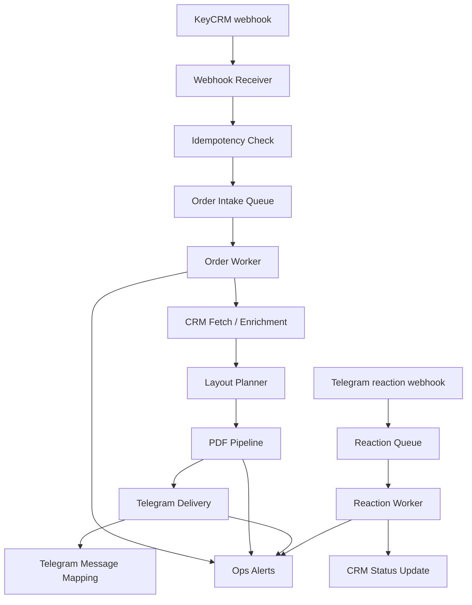

# Цільова архітектура TypeScript-проєкту

## 1. Цілі
- Переписати поточний JS-сервіс у TypeScript без втрати бізнес-логіки.
- Розділити систему на невеликі модулі з чіткими контрактами.
- Забезпечити стабільну роботу webhook, черг, PDF-процесингу і Telegram-відправки.
- Закласти основу для довготривалої підтримки і поступового масштабування.

## 2. Основні принципи
- `TypeScript strict mode` з максимально явними типами домену.
- Всі зовнішні інтеграції ізольовані адаптерами.
- Бізнес-правила винесені з коду: змінні workflow/routing правила в PostgreSQL, статичні SKU/QR mapping у versioned config.
- Webhook receiver не виконує важку роботу синхронно.
- PDF-обробка відокремлена від HTTP-приймача.
- Всі критичні дії логуються структуровано.
- Всі нештатні ситуації ведуть до retry, DLQ або алерта.

## 3. Цільовий production flow



## 4. Рекомендована структура проєкту

```text
config/
  business-rules/
    product-code-rules.json
    qr-rules.json
    reaction-status-rules.json

src/
  app/
    bootstrap.ts
    runtime.ts
    server.ts
  config/
    config.types.ts
    load-config.ts
    validate-config.ts
  modules/
    alerts/
      ops-alert.service.ts
    crm/
      crm-client.ts
    db/
      postgres-client.ts
      postgres-schema.ts
    layout/
      layout-plan-builder.ts
      filename-builder.ts
      sku-classifier.ts
    orders/
      order-idempotency.ts
    pdf/
      pdf-pipeline.service.ts
    qr/
      qr-code.ts
      qr-rules.ts
      spotify-code.ts
    queue/
      queue-service.ts
      queue-jobs.ts
      db-dead-letter-store.ts
    reactions/
      reaction-status-rules.ts
      db-reaction-status-rules-store.ts
    storage/
      storage-retention.service.ts
    telegram/
      telegram-delivery.service.ts
      db-telegram-message-map-store.ts
      db-telegram-routing-config-store.ts
      telegram-routing-config.ts
    webhook/
      keycrm-webhook.controller.ts
      telegram-webhook.controller.ts
      webhook-auth.ts
  workers/
    order-intake-worker.ts
    reaction-intake-worker.ts
```

## 5. Ролі модулів
- `webhook`
  - приймає webhook, валідовує, нормалізує payload, ставить задачу в чергу.
- `crm`
  - відповідає тільки за читання і запис у CRM.
- `orders`
  - керує всім життєвим циклом одного замовлення.
- `layout`
  - визначає, які матеріали потрібні, як вони називаються і в якому порядку йдуть.
  - включно з manual-only позиціями (`A6`, `брелок`) у `total` нумерації.
- `pdf`
  - вся важка логіка PDF, CMYK, QR, Spotify code, engraving, sticker.
- `telegram`
  - відправка файлів, прев'ю, alert-повідомлень, routing у `ЗАМОВЛЕННЯ`, mapping message id -> order id.
- `reactions`
  - обробка workflow-emoji у Telegram (`❤️`, `👍`) і оновлення статусів у CRM.
  - stage resolver працює за `emoji + countThreshold (+emojiAliases)` з монотонними переходами.
- `url-shortener`
  - скорочення URL перед QR (`lnk.ua` primary, `cutt.ly` fallback).
- `queue`
  - постановка задач, retry, DLQ, обмеження concurrency.
- `observability`
  - логи, метрики, warning/error notifications.

## 6. Черги і типи job
Рекомендовані типи задач:
- `order.intake`
  - основна постановка order у роботу після webhook.
- `order.process`
  - повна обробка замовлення.
- `pdf.generate`
  - важка PDF-фаза, яку краще відокремити.
- `telegram.send`
  - доставка прев'ю і файлів.
- `reaction.process`
  - обробка реакцій Telegram.
- `forwarding.send`
  - пересилання комплекту в `ЗАМОВЛЕННЯ` після `PRINT`.
- `alerts.send`
  - аварійні повідомлення в ops-чат.

## 7. Рекомендована модель надійності
- Receiver відповідає після успішного enqueue, а не після повної обробки:
  - KeyCRM webhook: `200`
  - Telegram webhook: `202`
- Кожен job має `idempotency key`.
- Повторний webhook по тому самому замовленню не має дублювати результати.
- Всі critical jobs мають retry з backoff.
- Після вичерпання retry задача переходить у `DLQ`.
- При переході в `DLQ` бот шле alert у технічний чат.

## 8. Пріоритети довіри до даних
Для whitelisted SKU:
- explicit mapping із ТЗ і конфігів.
- `offer.properties`.
- `product.properties`.
- евристика по `Variant`, `name`, `sku`.

Для невідомих SKU:
- `offer.properties`.
- `product.properties`.
- `Variant`, `name`, `sku`.

## 9. Мінімальний конфіг, який має змінюватися без коду
- у PostgreSQL:
- `status_id` для всіх переходів.
- список emoji і кількість реакцій для кожного статусного переходу.
- whitelist `allowedEmojis` для webhook parser.
- enabled/disabled прапори stage (`PRINT` active, `PACKING(👍)` deferred).
- stage trigger policy:
  - `PRINT` -> `emoji=❤️`, `count>=1`
  - `PACKING` -> `emoji=👍`, `count>=1` (pilot/disabled за замовчуванням)
- topology `processing/orders/ops` з chat/thread id.
- forwarding mode (`copy` / `forward`).

- у versioned JSON:
- whitelist SKU для QR і Spotify code.
- special mapping SKU -> poster code.
- mapping значень підставки -> `W`, `WW`, `MWW`, `C`, `K`.
- параметри placement для QR/Spotify.
- shortener provider order (`lnk.ua` -> `cutt.ly`).

Bootstrap rule:
- `reaction-status-rules.json` і `TELEGRAM_*` env використовуються для першого seed у БД;
- після цього runtime читає reaction/routing config із PostgreSQL.

## 10. Логування
Логи мають бути структуровані.

Рекомендовані поля:
- `timestamp`
- `level`
- `service`
- `module`
- `event`
- `order_id`
- `job_id`
- `chat_id`
- `message_id`
- `status_id`
- `sku`
- `duration_ms`
- `error_code`
- `error_message`

## 11. Alerts у Telegram
Окремий технічний чат або topic потрібен для:
- падіння CRM API;
- падіння Telegram API;
- провалу PDF generation;
- переходу задачі в DLQ;
- помилок конфігурації при старті;
- переповнення черги;
- нестачі місця на диску;
- зависання worker.

## 12. CPU / RAM оцінка
Оцінка консервативна, для одного worker-процесу.

Легка стадія:
- webhook / CRM / Telegram metadata
- CPU: низьке
- RAM: `80-200 MB`

PDF-стадія:
- A5 при `600 DPI` може давати пік RAM приблизно `250-500 MB` на один активний PDF-pass
- A4 при `600 DPI` може давати пік RAM приблизно `450-900 MB` на один активний PDF-pass
- кілька проходів recolor + CMYK + Ghostscript можуть піднімати піки ще вище

Практичне правило:
- на одному worker не варто паралелити більше `1` важкого PDF job без окремого stress-тесту;
- для невеликого production краще мати:
  - `1` receiver process
  - `1` order worker
  - `1` PDF worker з concurrency `1`
  - `1` reaction worker

## 13. Вузькі місця
- Ghostscript і rasterization PDF.
- тимчасові PNG/PDF файли на диску.
- великі прев'ю або биті source PDF.
- rate limit Telegram API.
- дубльовані webhook.
- неузгоджені SKU та `offer.properties`.

## 14. Що робити в production
- Розділити HTTP receiver і heavy worker хоча б логічно, краще процесно.
- Тримати durable queue поза memory-only режимом.
- Зберігати технічні mapping-и і idempotency state у persistent storage.
- Зберігати generated files і temp files з чіткою політикою cleanup.
- Мати healthcheck, readiness check і queue backlog monitoring.

## 15. Рекомендована production-модель
Базова надійна схема для цього бізнес-процесу:
- `1` Node.js/TypeScript receiver service
- `1` durable queue backend
- `1-2` worker services
- persistent storage для message mapping, idempotency, DLQ, audit trail
- локальний диск або object storage для артефактів PDF

Це не overengineering для “не мільйона користувачів”, бо головний ризик тут не трафік, а стабільність важкого PDF-процесу і відновлення після помилок.
